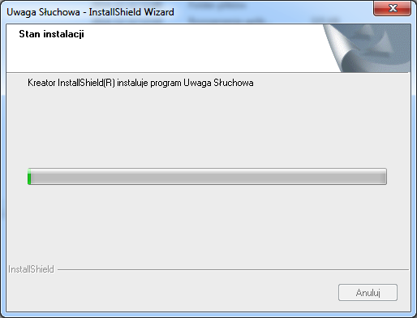

## Praktyczna instrukcja instalacji programu Uwaga Słuchowa

> *Do instalacji jest potrzeby program instalacyjny umieszczony na pendrivie bądź pobrany ze strony, zapisany i rozpakowany na komputerze oraz numer licencji który jest wydrukowany na karcie licencyjnej.
W trakcie instalacji program zapyta nas o aktywacje.
Aby jej dokonać komputer musi być podłączony do internetu lub trzeba połączyć się telefonicznie z działem HelpDesk firmy Young Digital Planet SA.
Aby instalacja przebiegła poprawnie przed jej rozpoczęciem należy sprawdzić czy data i czas w komputerze jest ustawiony prawidłowo.
*
>

###Instalatory:

| Instalator	|Wersja	| Link 	|Uwagi|
|:------------|:------:|:-------------:|:---------------|
|Uwaga Słuchowa|1.01|[US12122014.zip](http://)| Wersja aktualna
|Therapymanager |1.01|[TherapyManager.zip](http://)| Poprawka do wersji z przed 12.2014
|Uwaga Słuchowa |2.00	|[US23012015.zip](http://)| Wersja beta z fazą aktywna

###Instalacja:

> 1\. Umieszczamy pendrive z programem instalacyjnym w gnieździe USB i za pomocą Exploratora Windows otwieramy jego zawartość.

> I uruchamiamy program Setup.

>  2\. Program Setup po uruchomieniu pokazuje okno gdzie klikamy przycisk „Dalej”

> 3\.  W następnym okienku należy zaakceptować postanowienia licencyjne i kliknąć  przycisk „Dalej”

> 4\. Pojawi się okienko z prośbą o wpisanie numeru licencji.

> Wpisujemy numer licencji i klikamy na przycisk „Akceptuj”

> Okienko zmienia zawartość na następującą :

> Tutaj należy dokonać aktywacji.

> Jeśli komputer jest podłączony do internetu klikamy na przycisk „Aktywacja on-line”

> Jeśli komputer jednak nie ma takiego podłączenia trzeba połączyć się z działem HelpDesk gdzie pracownik na podstawie numeru licencji i numeru komputera wygeneruje i poda klucz aktywujący.

> Po aktywacji klikamy na przycisk „Dalej”

>   5\. Pojawia nam się okno z wyborem katalogu do instalacji

> Zalecam pozostawienie domyślnego katalogu i klikamy na przycisk „Dalej”

> 6\. Pojawia się okienko finalizujące proces instalacji.
Klikamy na przycisk „Instaluj”

> 7\. Następne okno pokazuje nam progres instalacji oraz podsumowanie instalacji.

> Klikamy na przycisk „Zakończ”.

> 8\. Na pulpicie Windows pojawia się skrót do programu za pomocą którego uruchamiamy aplikacje Uwagi Słuchowej

###Konfiguracja systemu:

> *Oprócz instalacji należy zmodyfikować nieco system Windows tak aby korzystanie z programu i urządzenia przebiegało bezproblemowo.*

* W tym celu w systemie Windows uruchamiamy Explorator i na ikonie „Ten komputer” klikamy prawym klawiszem myszy i wybieramy z menu kontekstowego pozycje „Zarządzaj”

Pojawia nam się okienko jak wyżej w którym wybieramy w lewej części okna „Menedżer urządzeń”
W prawej części pojawi się zawartość „Menedżera urządzeń” gdzie wybieramy „Kontrolery uniwersalnej magistrali szeregowej”

* Następnie po kolei wybieramy wymienione tam urządzenia i w każdym wybieramy i wyłączamy „Zarządzanie energią” jak na obrazku poniżej.

* Dodatkowo w tym samym „Menedżerze  urządzeń” w pozycji  „Kontrolery dźwięku, muzyki i gier” wyłączamy wszystkie inne karty dźwiękowe poza urządzeniami Edusensus1 i Edusensus2

* Ostatnie co robimy to w Panelu Sterowania w Opcjach Zasilania zmieniamy tak ustawienia aby komputer nie przechodził nam w stan uśpienia w momencie prowadzenia terapii

* _Zamykamy wszystkie okienka i możemy uruchomić nasz program._
